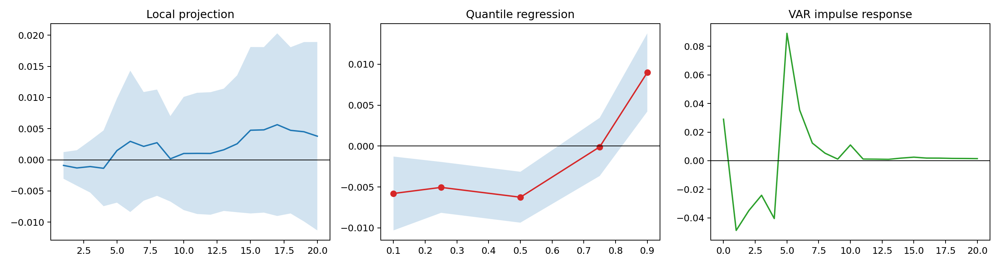

# 动态情绪指数统计检验

> 以下结果是探索性关联检验，不构成严格因果识别。指数参数使用全样本估计，局部投影和VAR使用过滤状态，但仍存在参数估计层面的前视信息。

## 平稳性

| variable                   |   adf_statistic |     p_value |   used_lag |   nobs |
|:---------------------------|----------------:|------------:|-----------:|-------:|
| dynamic_sentiment_filtered |        -3.29748 | 0.0149913   |          1 |   1314 |
| dynamic_sentiment_change   |        -9.02008 | 5.80724e-15 |         23 |   1292 |
| return_ew                  |       -18.6142  | 2.06391e-30 |          3 |   1312 |
| excess_return_hs300        |       -35.9112  | 0           |          0 |   1315 |

## 局部投影

|   horizon |   coefficient |   std_error |      ci_low |    ci_high |   p_value |   nobs |
|----------:|--------------:|------------:|------------:|-----------:|----------:|-------:|
|         1 |  -0.000899487 |  0.00109105 | -0.00303795 | 0.00123897 |  0.4097   |   1315 |
|         2 |  -0.00130782  |  0.00145376 | -0.00415718 | 0.00154154 |  0.368326 |   1314 |
|         3 |  -0.00108317  |  0.00212996 | -0.0052579  | 0.00309156 |  0.611075 |   1313 |
|         4 |  -0.00136359  |  0.00310205 | -0.00744361 | 0.00471643 |  0.660243 |   1312 |
|         5 |   0.00147867  |  0.00426219 | -0.00687522 | 0.00983257 |  0.728646 |   1311 |
|         6 |   0.00296195  |  0.00578676 | -0.0083801  | 0.014304   |  0.608756 |   1310 |
|         7 |   0.00215372  |  0.00444872 | -0.00656578 | 0.0108732  |  0.6283   |   1309 |
|         8 |   0.00274723  |  0.00435102 | -0.00578077 | 0.0112752  |  0.527779 |   1308 |
|         9 |   0.000160653 |  0.00350058 | -0.00670048 | 0.00702179 |  0.963395 |   1307 |
|        10 |   0.00101389  |  0.00463428 | -0.0080693  | 0.0100971  |  0.82682  |   1306 |
|        11 |   0.00103055  |  0.0049627  | -0.00869634 | 0.0107574  |  0.835495 |   1305 |
|        12 |   0.00101778  |  0.00501796 | -0.00881743 | 0.010853   |  0.83927  |   1304 |
|        13 |   0.00160877  |  0.00500762 | -0.00820616 | 0.0114237  |  0.74801  |   1303 |
|        14 |   0.00257196  |  0.00560635 | -0.00841648 | 0.0135604  |  0.646408 |   1302 |
|        15 |   0.00474732  |  0.00681436 | -0.00860883 | 0.0181035  |  0.486013 |   1301 |
|        16 |   0.00480709  |  0.006776   | -0.00847387 | 0.018088   |  0.478058 |   1300 |
|        17 |   0.0056392   |  0.00747668 | -0.00901509 | 0.0202935  |  0.450706 |   1299 |
|        18 |   0.00472996  |  0.00680556 | -0.00860894 | 0.0180689  |  0.487047 |   1298 |
|        19 |   0.00450282  |  0.007343   | -0.00988946 | 0.0188951  |  0.539736 |   1297 |
|        20 |   0.0037897   |  0.00771318 | -0.0113281  | 0.0189075  |  0.623195 |   1296 |

## 五日收益分位数回归

|   quantile |   coefficient |   std_error |      ci_low |     ci_high |     p_value |   nobs |   p_value_fdr |
|-----------:|--------------:|------------:|------------:|------------:|------------:|-------:|--------------:|
|       0.1  |  -0.00579841  |  0.00230273 | -0.0103118  | -0.00128506 | 0.0119192   |   1311 |   0.014899    |
|       0.25 |  -0.00505354  |  0.00158711 | -0.00816428 | -0.0019428  | 0.00148629  |   1311 |   0.00247715  |
|       0.5  |  -0.00625564  |  0.00158758 | -0.0093673  | -0.00314398 | 8.56671e-05 |   1311 |   0.000428336 |
|       0.75 |  -0.000102912 |  0.0018141  | -0.00365854 |  0.00345272 | 0.95477     |   1311 |   0.95477     |
|       0.9  |   0.00899541  |  0.00243826 |  0.00421642 |  0.0137744  | 0.000234137 |   1311 |   0.000585341 |

## VAR诊断

|   selected_lag | stable   |   nobs |      aic |      bic |
|---------------:|:---------|-------:|---------:|---------:|
|              6 | True     |   1310 | -3.59264 | -3.36735 |

| caused          | causing         |   test_statistic |    p_value |   df |
|:----------------|:----------------|-----------------:|-----------:|-----:|
| excess_return   | sentiment_shock |         18.7669  | 0.00457602 |    6 |
| sentiment_shock | excess_return   |          3.45007 | 0.750601   |    6 |

## 高情绪冲击事件研究

|   horizon |   events |   mean_abnormal_return |   std_error |      ci_low |     ci_high |   shock_threshold |
|----------:|---------:|-----------------------:|------------:|------------:|------------:|------------------:|
|         0 |       28 |            0.00321549  |  0.00490311 | -0.0063946  |  0.0128256  |       -9.8953e-10 |
|         1 |       28 |           -0.000416473 |  0.0035047  | -0.00728568 |  0.00645273 |       -9.8953e-10 |
|         5 |       28 |           -0.0189799   |  0.00875566 | -0.036141   | -0.00181878 |       -9.8953e-10 |
|        10 |       28 |           -0.0185881   |  0.0124714  | -0.0430321  |  0.00585584 |       -9.8953e-10 |
|        20 |       28 |            0.0154892   |  0.0227484  | -0.0290976  |  0.0600761  |       -9.8953e-10 |

显著性结果应结合样本量、事件聚集、公告选择偏差和多重检验谨慎解释。下一步正式论文版本应加入滚动估计、安慰剂日期和替代半衰期稳健性检验。
