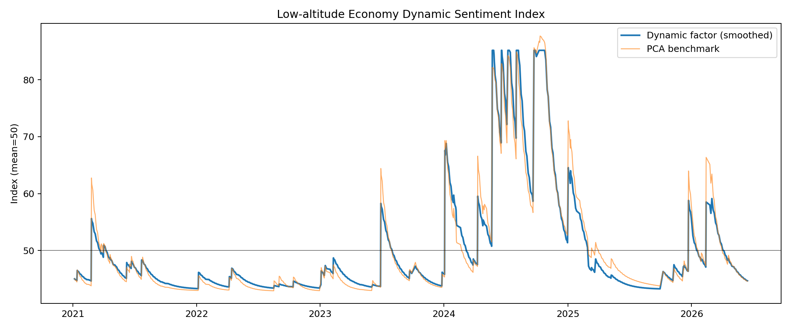

# 低空经济动态情绪指数

## 构造方法

指数由政策支持、企业景气、置信度余额和有方向的事件广度四个通道构成。公司事件采用方向、强度和不确定性加权；政策事件进一步加入新颖度。事件冲击通过指数衰减转化为日频状态，再使用单因子动态因子模型提取共同变化。风险压力保留在日频明细中，但不作为无方向的活跃度信号进入因子。

- 企业事件影响半衰期：20个交易日。
- 政策支持影响半衰期：60个交易日。
- 置信度余额半衰期：20个交易日。
- 有方向事件广度半衰期：10个交易日。

## 载荷

| channel            |   pca_loading |   dynamic_factor_loading |
|:-------------------|--------------:|-------------------------:|
| policy_support     |     0.466312  |                0.131286  |
| company_sentiment  |    -0.0352352 |                0.0524505 |
| confidence_balance |     0.627631  |                0.343192  |
| signed_breadth     |     0.622407  |                0.55443   |

## 诊断

| active_start        |   observations |   company_events |   policy_events |   pca_explained_variance | dynamic_factor_converged   |      aic |      bic |   pca_dynamic_correlation |
|:--------------------|---------------:|-----------------:|----------------:|-------------------------:|:---------------------------|---------:|---------:|--------------------------:|
| 2021-01-06 00:00:00 |           1316 |               46 |             123 |                 0.813897 | True                       | -2109.06 | -2041.69 |                  0.986568 |

`dynamic_sentiment_smoothed`适合历史解释和可视化；`dynamic_sentiment_filtered`适合时序统计分析。模型参数仍由全样本估计，严格预测时需要滚动重估。指数在首个有效事件之前设为中性值50。

