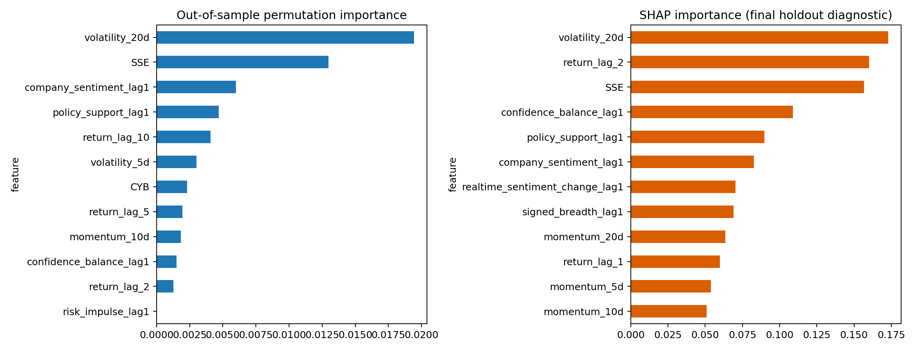

# 实时指数严格时序预测

使用5折扩展时间序列切分和20个交易日间隔。实时情绪指数按月仅使用历史数据估计，进入预测时再滞后1个交易日。未知未来收益保持为缺失值，不参与评估。

## 样本外指标

| model                  | feature_set                      |   observations |      auc |   accuracy |       f1 |    brier |   log_loss |
|:-----------------------|:---------------------------------|---------------:|---------:|-----------:|---------:|---------:|-----------:|
| logistic               | technical_only                   |            880 | 0.539376 |   0.532955 | 0.477764 | 0.271145 |   0.766896 |
| hist_gradient_boosting | technical_only                   |            880 | 0.513098 |   0.509091 | 0.474453 | 0.301133 |   0.8675   |
| logistic               | technical_plus_realtime_index    |            880 | 0.529672 |   0.521591 | 0.527497 | 0.277358 |   0.780667 |
| hist_gradient_boosting | technical_plus_realtime_index    |            880 | 0.511692 |   0.5125   | 0.488677 | 0.296249 |   0.838379 |
| logistic               | technical_plus_realtime_channels |            880 | 0.475399 |   0.486364 | 0.54065  | 0.380581 |   2.39248  |
| hist_gradient_boosting | technical_plus_realtime_channels |            880 | 0.509774 |   0.514773 | 0.482424 | 0.295229 |   0.824911 |

最高AUC为0.5394，对应logistic / technical_only。

## SHAP全局重要性

| feature                        |   mean_abs_shap |   mean_signed_shap |
|:-------------------------------|----------------:|-------------------:|
| volatility_20d                 |       0.172875  |        -0.0569224  |
| return_lag_2                   |       0.160199  |        -0.0161453  |
| SSE                            |       0.156635  |         0.00490437 |
| confidence_balance_lag1        |       0.108863  |         0.0698951  |
| policy_support_lag1            |       0.0897684 |        -0.0702741  |
| company_sentiment_lag1         |       0.0826333 |         0.0381762  |
| realtime_sentiment_change_lag1 |       0.0704329 |        -0.0357647  |
| signed_breadth_lag1            |       0.0690925 |         0.00891346 |
| momentum_20d                   |       0.0635889 |        -0.00394059 |
| return_lag_1                   |       0.0598985 |        -0.0121852  |
| momentum_5d                    |       0.0537831 |         0.00427037 |
| momentum_10d                   |       0.0509504 |        -0.0152902  |
| return_lag_10                  |       0.0504066 |         0.00563993 |
| HS300                          |       0.041111  |        -0.0171777  |
| volatility_10d                 |       0.0406122 |         0.0129847  |

SHAP使用最后250个可用观测作为诊断集；更严格的主要解释依据是各时间折测试集上的置换重要性。任何接近0.5的AUC都应解释为预测能力有限，而不是可交易策略。

