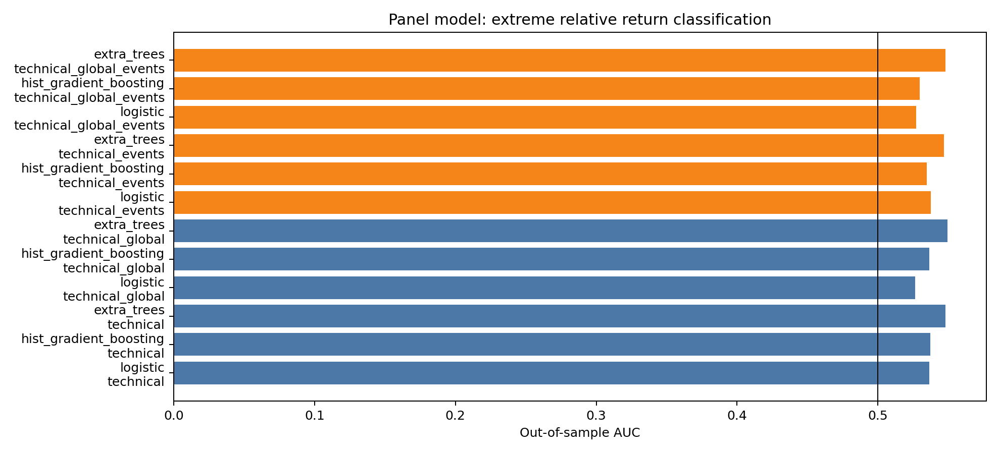

# 个股面板严格时序预测

所有股票按交易日期整体进入训练集或测试集，使用5折扩展窗口和20个交易日间隔。公司代码、产业角色和样本层级以独热编码进入模型。

## 各目标最佳结果

| target              | subset   | model       | feature_set      |   observations |   positive_share |      auc |   accuracy |   balanced_accuracy |       f1 |    brier |
|:--------------------|:---------|:------------|:-----------------|---------------:|-----------------:|---------:|-----------:|--------------------:|---------:|---------:|
| extreme_relative_5d | all      | extra_trees | technical_global |          31559 |         0.513926 | 0.54949  |   0.540955 |            0.542532 | 0.521075 | 0.249477 |
| outperform_5d       | all      | logistic    | technical_global |          52103 |         0.464657 | 0.503515 |   0.497591 |            0.501587 | 0.50796  | 0.291414 |
| volatility_jump_5d  | all      | extra_trees | technical        |          52061 |         0.240103 | 0.675547 |   0.612685 |            0.628074 | 0.449161 | 0.22167  |

## 全部结果

| target              | subset           | model                  | feature_set             |   observations |   positive_share |      auc |   accuracy |   balanced_accuracy |       f1 |    brier |
|:--------------------|:-----------------|:-----------------------|:------------------------|---------------:|-----------------:|---------:|-----------:|--------------------:|---------:|---------:|
| outperform_5d       | all              | logistic               | technical               |          52103 |         0.464657 | 0.503319 |   0.496881 |            0.496414 | 0.474985 | 0.258923 |
| outperform_5d       | event_window_20d | logistic               | technical               |            577 |         0.485269 | 0.526792 |   0.521664 |            0.518795 | 0.460938 | 0.255374 |
| outperform_5d       | all              | hist_gradient_boosting | technical               |          52103 |         0.464657 | 0.489834 |   0.50951  |            0.50111  | 0.420052 | 0.26517  |
| outperform_5d       | event_window_20d | hist_gradient_boosting | technical               |            577 |         0.485269 | 0.495082 |   0.516464 |            0.512518 | 0.431772 | 0.268024 |
| outperform_5d       | all              | extra_trees            | technical               |          52103 |         0.464657 | 0.502398 |   0.511583 |            0.506319 | 0.451055 | 0.251779 |
| outperform_5d       | event_window_20d | extra_trees            | technical               |            577 |         0.485269 | 0.488167 |   0.507799 |            0.50502  | 0.447471 | 0.256105 |
| outperform_5d       | all              | logistic               | technical_global        |          52103 |         0.464657 | 0.503515 |   0.497591 |            0.501587 | 0.50796  | 0.291414 |
| outperform_5d       | event_window_20d | logistic               | technical_global        |            577 |         0.485269 | 0.517737 |   0.518198 |            0.516655 | 0.483271 | 0.295529 |
| outperform_5d       | all              | hist_gradient_boosting | technical_global        |          52103 |         0.464657 | 0.474287 |   0.505575 |            0.492513 | 0.366445 | 0.289006 |
| outperform_5d       | event_window_20d | hist_gradient_boosting | technical_global        |            577 |         0.485269 | 0.448978 |   0.5026   |            0.49445  | 0.298289 | 0.313443 |
| outperform_5d       | all              | extra_trees            | technical_global        |          52103 |         0.464657 | 0.459961 |   0.482218 |            0.471832 | 0.368345 | 0.267813 |
| outperform_5d       | event_window_20d | extra_trees            | technical_global        |            577 |         0.485269 | 0.456481 |   0.504333 |            0.4992   | 0.388889 | 0.27667  |
| outperform_5d       | all              | logistic               | technical_events        |          52103 |         0.464657 | 0.503131 |   0.498205 |            0.497465 | 0.474208 | 0.259556 |
| outperform_5d       | event_window_20d | logistic               | technical_events        |            577 |         0.485269 | 0.460871 |   0.45234  |            0.447878 | 0.344398 | 0.300594 |
| outperform_5d       | all              | hist_gradient_boosting | technical_events        |          52103 |         0.464657 | 0.484662 |   0.50285  |            0.495607 | 0.423596 | 0.266203 |
| outperform_5d       | event_window_20d | hist_gradient_boosting | technical_events        |            577 |         0.485269 | 0.469986 |   0.511265 |            0.50757  | 0.431452 | 0.276639 |
| outperform_5d       | all              | extra_trees            | technical_events        |          52103 |         0.464657 | 0.50074  |   0.50976  |            0.505011 | 0.453544 | 0.251984 |
| outperform_5d       | event_window_20d | extra_trees            | technical_events        |            577 |         0.485269 | 0.480279 |   0.493934 |            0.49145  | 0.438462 | 0.256895 |
| outperform_5d       | all              | logistic               | technical_global_events |          52103 |         0.464657 | 0.503163 |   0.498877 |            0.502851 | 0.509026 | 0.289889 |
| outperform_5d       | event_window_20d | logistic               | technical_global_events |            577 |         0.485269 | 0.48343  |   0.5026   |            0.500685 | 0.45951  | 0.318244 |
| outperform_5d       | all              | hist_gradient_boosting | technical_global_events |          52103 |         0.464657 | 0.468334 |   0.505172 |            0.492701 | 0.37264  | 0.29364  |
| outperform_5d       | event_window_20d | hist_gradient_boosting | technical_global_events |            577 |         0.485269 | 0.454101 |   0.514731 |            0.506439 | 0.310345 | 0.315953 |
| outperform_5d       | all              | extra_trees            | technical_global_events |          52103 |         0.464657 | 0.458517 |   0.486076 |            0.473224 | 0.345097 | 0.266933 |
| outperform_5d       | event_window_20d | extra_trees            | technical_global_events |            577 |         0.485269 | 0.457528 |   0.506066 |            0.499964 | 0.365256 | 0.274662 |
| extreme_relative_5d | all              | logistic               | technical               |          31559 |         0.513926 | 0.536472 |   0.528692 |            0.528962 | 0.531055 | 0.253867 |
| extreme_relative_5d | event_window_20d | logistic               | technical               |            331 |         0.486405 | 0.542565 |   0.561934 |            0.563665 | 0.582133 | 0.253689 |
| extreme_relative_5d | all              | hist_gradient_boosting | technical               |          31559 |         0.513926 | 0.5373   |   0.530562 |            0.529614 | 0.552403 | 0.253451 |
| extreme_relative_5d | event_window_20d | hist_gradient_boosting | technical               |            331 |         0.486405 | 0.619693 |   0.598187 |            0.601261 | 0.633609 | 0.241562 |
| extreme_relative_5d | all              | extra_trees            | technical               |          31559 |         0.513926 | 0.547975 |   0.537153 |            0.538206 | 0.526347 | 0.249284 |
| extreme_relative_5d | event_window_20d | extra_trees            | technical               |            331 |         0.486405 | 0.587358 |   0.586103 |            0.583741 | 0.538721 | 0.245367 |
| extreme_relative_5d | all              | logistic               | technical_global        |          31559 |         0.513926 | 0.526303 |   0.527583 |            0.524529 | 0.579803 | 0.269248 |
| extreme_relative_5d | event_window_20d | logistic               | technical_global        |            331 |         0.486405 | 0.607344 |   0.610272 |            0.614669 | 0.659631 | 0.254397 |
| extreme_relative_5d | all              | hist_gradient_boosting | technical_global        |          31559 |         0.513926 | 0.536606 |   0.529168 |            0.529114 | 0.536886 | 0.25363  |
| extreme_relative_5d | event_window_20d | hist_gradient_boosting | technical_global        |            331 |         0.486405 | 0.606796 |   0.577039 |            0.578699 | 0.595376 | 0.24332  |
| extreme_relative_5d | all              | extra_trees            | technical_global        |          31559 |         0.513926 | 0.54949  |   0.540955 |            0.542532 | 0.521075 | 0.249477 |
| extreme_relative_5d | event_window_20d | extra_trees            | technical_global        |            331 |         0.486405 | 0.595068 |   0.589124 |            0.586682 | 0.540541 | 0.244903 |
| extreme_relative_5d | all              | logistic               | technical_events        |          31559 |         0.513926 | 0.537504 |   0.528597 |            0.528972 | 0.529194 | 0.254423 |
| extreme_relative_5d | event_window_20d | logistic               | technical_events        |            331 |         0.486405 | 0.607234 |   0.595166 |            0.594373 | 0.575949 | 0.260154 |
| extreme_relative_5d | all              | hist_gradient_boosting | technical_events        |          31559 |         0.513926 | 0.53464  |   0.530752 |            0.530152 | 0.547195 | 0.2545   |
| extreme_relative_5d | event_window_20d | hist_gradient_boosting | technical_events        |            331 |         0.486405 | 0.539971 |   0.549849 |            0.551407 | 0.568116 | 0.259768 |
| extreme_relative_5d | all              | extra_trees            | technical_events        |          31559 |         0.513926 | 0.546676 |   0.536899 |            0.538072 | 0.523988 | 0.249437 |
| extreme_relative_5d | event_window_20d | extra_trees            | technical_events        |            331 |         0.486405 | 0.572853 |   0.543807 |            0.540427 | 0.470175 | 0.246914 |
| extreme_relative_5d | all              | logistic               | technical_global_events |          31559 |         0.513926 | 0.526966 |   0.527171 |            0.524132 | 0.579235 | 0.269552 |
| extreme_relative_5d | event_window_20d | logistic               | technical_global_events |            331 |         0.486405 | 0.631421 |   0.598187 |            0.598465 | 0.595745 | 0.258083 |
| extreme_relative_5d | all              | hist_gradient_boosting | technical_global_events |          31559 |         0.513926 | 0.529578 |   0.523591 |            0.524018 | 0.523228 | 0.254966 |
| extreme_relative_5d | event_window_20d | hist_gradient_boosting | technical_global_events |            331 |         0.486405 | 0.534673 |   0.543807 |            0.54388  | 0.538226 | 0.257672 |
| extreme_relative_5d | all              | extra_trees            | technical_global_events |          31559 |         0.513926 | 0.548071 |   0.539719 |            0.541037 | 0.524393 | 0.249558 |
| extreme_relative_5d | event_window_20d | extra_trees            | technical_global_events |            331 |         0.486405 | 0.596383 |   0.577039 |            0.573602 | 0.507042 | 0.245518 |
| volatility_jump_5d  | all              | logistic               | technical               |          52061 |         0.240103 | 0.67168  |   0.590173 |            0.62686  | 0.449706 | 0.244701 |
| volatility_jump_5d  | event_window_20d | logistic               | technical               |            577 |         0.272097 | 0.695056 |   0.60312  |            0.6516   | 0.509636 | 0.241909 |
| volatility_jump_5d  | all              | hist_gradient_boosting | technical               |          52061 |         0.240103 | 0.675025 |   0.745087 |            0.54952  | 0.246094 | 0.176251 |
| volatility_jump_5d  | event_window_20d | hist_gradient_boosting | technical               |            577 |         0.272097 | 0.64401  |   0.717504 |            0.53673  | 0.21256  | 0.193352 |
| volatility_jump_5d  | all              | extra_trees            | technical               |          52061 |         0.240103 | 0.675547 |   0.612685 |            0.628074 | 0.449161 | 0.22167  |
| volatility_jump_5d  | event_window_20d | extra_trees            | technical               |            577 |         0.272097 | 0.695268 |   0.623917 |            0.635972 | 0.489412 | 0.218846 |
| volatility_jump_5d  | all              | logistic               | technical_global        |          52061 |         0.240103 | 0.623942 |   0.54415  |            0.604595 | 0.431623 | 0.342404 |
| volatility_jump_5d  | event_window_20d | logistic               | technical_global        |            577 |         0.272097 | 0.663421 |   0.558059 |            0.630619 | 0.493042 | 0.343943 |
| volatility_jump_5d  | all              | hist_gradient_boosting | technical_global        |          52061 |         0.240103 | 0.665783 |   0.698872 |            0.582507 | 0.363836 | 0.201311 |
| volatility_jump_5d  | event_window_20d | hist_gradient_boosting | technical_global        |            577 |         0.272097 | 0.634425 |   0.694974 |            0.624955 | 0.45679  | 0.230072 |
| volatility_jump_5d  | all              | extra_trees            | technical_global        |          52061 |         0.240103 | 0.667533 |   0.57617  |            0.623721 | 0.447615 | 0.245407 |
| volatility_jump_5d  | event_window_20d | extra_trees            | technical_global        |            577 |         0.272097 | 0.655171 |   0.559792 |            0.599901 | 0.459574 | 0.255309 |
| volatility_jump_5d  | all              | logistic               | technical_events        |          52061 |         0.240103 | 0.670936 |   0.591037 |            0.625842 | 0.448577 | 0.24456  |
| volatility_jump_5d  | event_window_20d | logistic               | technical_events        |            577 |         0.272097 | 0.677601 |   0.618718 |            0.654337 | 0.511111 | 0.267536 |
| volatility_jump_5d  | all              | hist_gradient_boosting | technical_events        |          52061 |         0.240103 | 0.674287 |   0.744223 |            0.545613 | 0.234889 | 0.176492 |
| volatility_jump_5d  | event_window_20d | hist_gradient_boosting | technical_events        |            577 |         0.272097 | 0.639475 |   0.677643 |            0.517326 | 0.218487 | 0.201346 |
| volatility_jump_5d  | all              | extra_trees            | technical_events        |          52061 |         0.240103 | 0.675469 |   0.612147 |            0.6272   | 0.448246 | 0.221505 |
| volatility_jump_5d  | event_window_20d | extra_trees            | technical_events        |            577 |         0.272097 | 0.697816 |   0.629116 |            0.643532 | 0.497653 | 0.217471 |
| volatility_jump_5d  | all              | logistic               | technical_global_events |          52061 |         0.240103 | 0.624603 |   0.539521 |            0.604121 | 0.43169  | 0.344062 |
| volatility_jump_5d  | event_window_20d | logistic               | technical_global_events |            577 |         0.272097 | 0.645875 |   0.564991 |            0.61145  | 0.471579 | 0.356368 |
| volatility_jump_5d  | all              | hist_gradient_boosting | technical_global_events |          52061 |         0.240103 | 0.664355 |   0.700448 |            0.578947 | 0.356244 | 0.19671  |
| volatility_jump_5d  | event_window_20d | hist_gradient_boosting | technical_global_events |            577 |         0.272097 | 0.651668 |   0.689775 |            0.623377 | 0.455927 | 0.232904 |
| volatility_jump_5d  | all              | extra_trees            | technical_global_events |          52061 |         0.240103 | 0.66795  |   0.577918 |            0.623941 | 0.447695 | 0.242826 |
| volatility_jump_5d  | event_window_20d | extra_trees            | technical_global_events |            577 |         0.272097 | 0.663891 |   0.551127 |            0.595943 | 0.457023 | 0.250786 |

横截面极端强弱目标只保留每个交易日未来异常收益排名处于上下30%的股票，减少接近零收益的标签噪声。事件窗口结果样本较少，必须与全样本指标共同解释。

